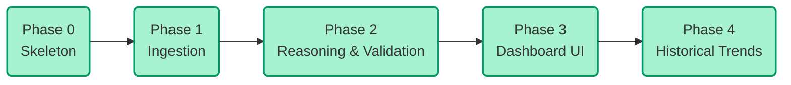

# Implementation Plan — Weekly Product Review Pulse

**Companions:** `ProblemStatement.md` (what & why) · `architecture.md` (how, system design & contracts)
**Current scope:** Multi-Product
**Status:** Completed Build
**Owner:** Harsh (Product)

---

## 1. Phase map (Completed)

---

## 2. Phase 0 — Skeleton [COMPLETED]

**Objective:** A runnable, end-to-end shell that does nothing real but exercises the full path.
- Configured project directory, `RunRecord`, `PulseReport`, and CLI framework.
- Set up SQLite `run_ledger.db` for idempotency tracking.

---

## 3. Phase 1 — Ingestion [COMPLETED]

**Objective:** Fetch real reviews from App Store and Google Play, clean them, and normalize them into a single canonical schema.
- Built App Store RSS scraper.
- Built Google Play scraper using `google-play-scraper`.
- Implemented `normalizer.py` to scrub PII and filter out emoji-only or ultra-short reviews.

---

## 4. Phase 2 — Reasoning & Semantic Validation [COMPLETED]

**Objective:** Embed, cluster, summarize, and strictly validate the output.
- Configured `BAAI/bge-small-en-v1.5` for sentence embeddings.
- Applied `UMAP` and `HDBSCAN` to automatically group organic issues.
- Implemented `Groq` (LLaMa 3.1 8B) summarization to extract Themes, Quotes, and Action Plans.
- **Semantic Validation Pipeline:**
  - `RapidFuzz` to guarantee quotes mathematically exist in the source review.
  - LLM Scoring (0-3) to drop irrelevant quotes.
  - LLM Summary Evaluation ("Supported" / "Unsupported").
  - Automated culling of hallucinated themes with 0 supporting evidence.

---

## 5. Phase 3 — React Dashboard UI [COMPLETED]

**Objective:** Replace the original Docs/Gmail delivery with a robust, interactive frontend.
- Built a `Vite + React + Tailwind` application.
- Implemented `Themes.jsx` for sortable, prioritized Theme Cards.
- Created `RatingBars.jsx` to visualize the distribution of sentiment.
- Added visual markers for **Evidence Score**, **Priority Score**, and **Validation Status**.

---

## 6. Phase 4 — Historical Trends [COMPLETED]

**Objective:** Turn point-in-time snapshots into a time-series intelligence platform.
- Implemented `src/state/history.py` to load previous reports.
- Used semantic embeddings (cosine similarity) to map new themes to historical ones.
- Calculated metrics: `Mentions WoW`, `Priority WoW`, `Age (weeks)`, and `First Seen`.
- Exposed these metrics to the Dashboard UI as "Trend Drivers".
