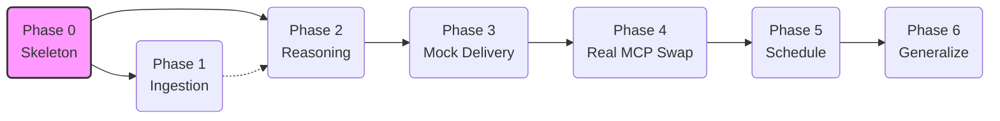
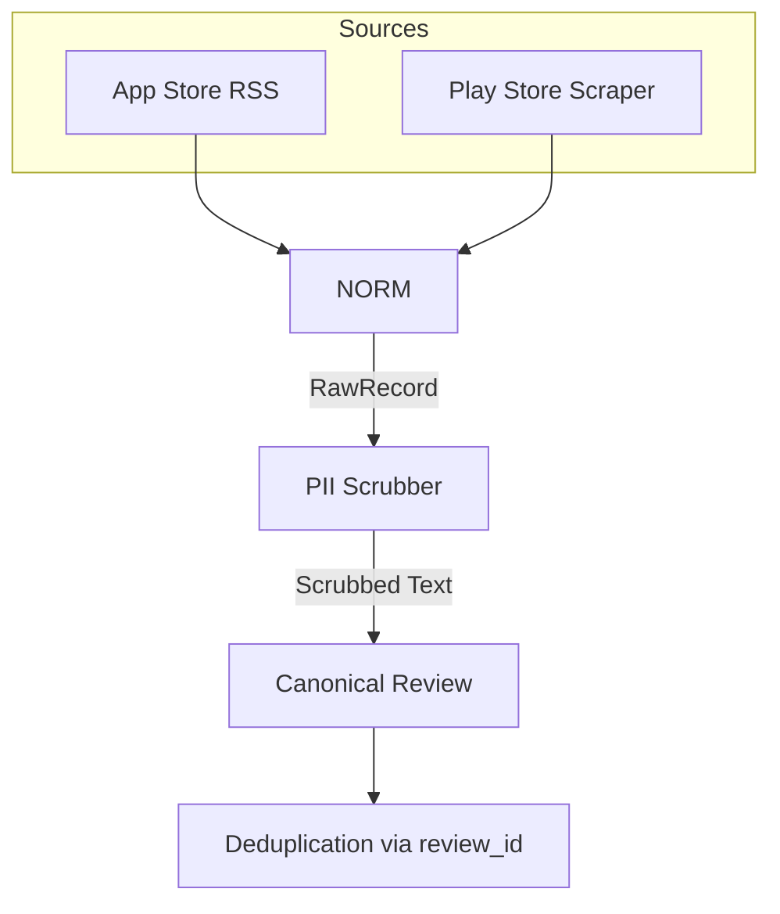
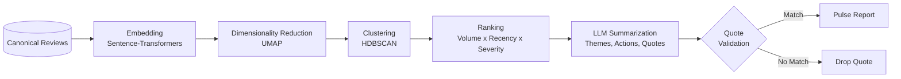
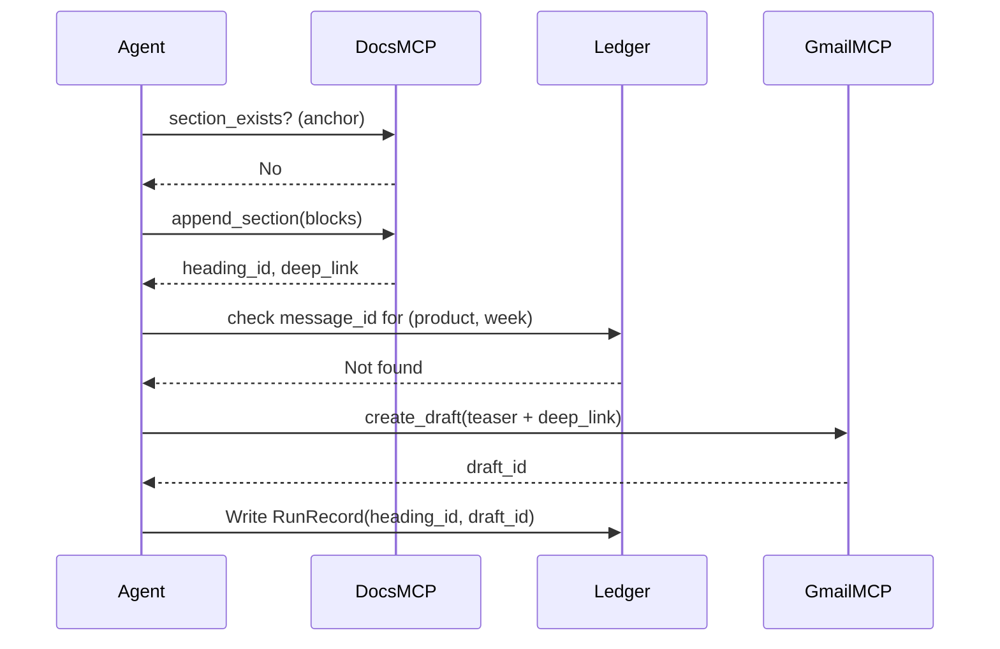

# Implementation Plan — Weekly Product Review Pulse

**Companions:** `ProblemStatement.md` (what & why) · `architecture.md` (how, system design & contracts)
**Current scope:** **INDMoney only**
**Status:** Active build
**Owner:** Harsh (Product)
**Dev environment:** Google Antigravity IDE (Gemini 3 Pro / Claude Sonnet; `.gemini/antigravity/brain/` knowledge base)
**Last updated:** _add date_

---

## 0. How to use this document

This is the execution playbook. It turns the architecture into an ordered set of phases, each with a clear objective, a task breakdown, deliverables, **testable acceptance criteria**, and an **exit gate** that must pass before the next phase starts. Every phase produces something demonstrable — important both for de-risking the build and for portfolio narrative (each phase is a checkpoint you can show).

**Guiding principles**
1. **Mock-first delivery.** The entire system is built and tested against mock MCP servers before the real Docs/Gmail MCP servers exist. The real swap (Phase 4) changes config, not logic.
2. **One canonical schema.** Everything downstream of ingestion sees only the `Review` model from `architecture.md §4`. No source-specific data leaks past the normalizer.
3. **Irreversible actions are gated.** Anything that writes to a real Doc or sends real email stays human-approved / draft-only until explicitly promoted.
4. **Every phase ships a demo.** If you can't demo it, the phase isn't done.

**Definition of Done (applies to every phase)**
- [ ] Code merged with tests passing in CI.
- [ ] Acceptance criteria for the phase met and demonstrated.
- [ ] Relevant decisions/contracts recorded in the Antigravity `brain/` knowledge base.
- [ ] No secrets committed; config-driven where the architecture requires it.

---

## 1. Phase map (at a glance)

*(Note: Phases 1 and 2 can overlap once the canonical schema is frozen in Phase 0. Phase 2 can be built against fixture reviews while Phase 1 adapters are still landing.)*

| Phase | Name | Objective | Key deliverable | Exit gate |
|---|---|---|---|---|
| **0** | Skeleton | Project scaffold, config, state, mock MCP | `pulse` CLI runs end-to-end against mocks (no real work) | A no-op run writes a `RunRecord` and a mock outbox file |
| **2** | Reasoning | Cluster, rank, summarize, validate quotes | A `PulseReport` object printed to console | Themes named, quotes validated, zero fabricated quotes |
| **3** | Render + mock deliver | Render Docs blocks + email teaser; deliver via mocks; idempotency | Mock Doc section + mock email draft with working deep link | Re-running same week creates **no** duplicate section/send |
| **4** | Real MCP swap | Point delivery at the provided external MCP servers | Real dated section in the INDMoney Doc + real Gmail draft | Config-only swap; reasoning/render untouched |
| **5** | Schedule + harden | Weekly cron, draft-only staging, cost ceilings, audit | Automated Monday-AM-IST run | An unattended scheduled run completes and is fully auditable |
| **6** | Generalize | Add remaining products via config; revisit taxonomy | Multi-product config + trending decision | A second product runs with no code change |

---

## 2. Phase 0 — Skeleton

**Objective:** A runnable, end-to-end shell that does nothing real but exercises the full path: CLI → orchestrator → mock delivery → run ledger. This freezes the contracts everything else builds against.

### Prerequisites
- Repo created in Antigravity; Python 3.11+ env.
- Repo layout from `architecture.md §11` scaffolded.

### Tasks
1. Scaffold the directory structure (`src/ingestion`, `reasoning`, `render`, `delivery`, `state`, `config`, `tests`).
2. Implement the canonical models as code: `Review`, `RawRecord`, `PulseReport`, `Theme`, `RunRecord` (from `architecture.md §4, §5.5, §7`). **Freeze these now.**
3. Implement `config/products.yaml` loader with the INDMoney block from `architecture.md §9`. Validate on load (typed config object; fail fast on missing fields).
4. Implement the **Run Ledger** (`state/ledger.py`) on SQLite: create/read/update `RunRecord`, keyed by `(product, iso_week)`.
5. Implement **mock MCP servers** (`delivery/mocks.py`): `MockDocsMCP` (writes a fake doc JSON), `MockGmailMCP` (writes `.html` drafts to `outbox/`). Both honor the tool contracts in `architecture.md §6.1–6.2` and return synthetic `heading_id`/`message_id`/`deep_link`.
6. Implement the `delivery/mcp_client.py` abstraction so the orchestrator talks to *either* mock or real via config (`run.delivery_target: mock|real`).
7. Implement the orchestrator skeleton: compute `iso_week`, build anchor `indmoney-{iso_week}`, run a no-op pipeline, call mock delivery, write `RunRecord`.
8. Implement `cli.py` (`typer`/`click`): `run`, `--product`, `--week`, `--dry-run`, `--send` flags.
9. Seed the Antigravity `brain/`: canonical schema, MCP tool contracts, idempotency rule, "delivery is irreversible — gate it."

### Deliverables
- `pulse run --product indmoney --dry-run` executes top to bottom.
- A `RunRecord` row and a mock outbox artifact.

### Acceptance criteria
- [ ] `pulse run --product indmoney` completes with exit code 0 and writes a `RunRecord`.
- [ ] Switching `delivery_target` between `mock` and (stub) `real` requires **no code edit**.
- [ ] Config validation rejects a malformed `products.yaml` with a clear error.
- [ ] Models are importable and typed; unit tests instantiate each.

### Tests
- Config loader: valid load, missing-field rejection.
- Ledger: write → read round-trip; idempotent upsert on same key.
- Mock delivery: returns well-formed synthetic ids + deep link.

---

## 3. Phase 1 — Ingestion (INDMoney, 2 sources)

### Prerequisites
- Phase 0 exit gate passed (canonical schema frozen).

### Tasks (build in this order — stable → brittle)
1. **App Store RSS adapter** (`ingestion/app_store.py`): fetch paginated customer-reviews RSS for INDMoney (country `in`); map to `RawRecord`. Most stable source — do first.
2. **Play Store adapter** (`ingestion/play_store.py`): scraper-based fetch (e.g. `google-play-scraper`); map to `RawRecord`. Wrap in robust error handling; raise typed `SourceError` on hard failure.
4. **Window filtering:** each adapter respects the configurable 8–12 week window (`window_weeks`).
6. **PII scrubber** (`pii.py`): strip emails, phone numbers, @handles, obvious names from `text`. Runs at normalization. `raw_text` is completely deleted.
7. **Dedup:** drop duplicate `review_id`s across re-ingestion.
8. **Partial-run handling:** orchestrator records `sources_covered`; a single source failure → `status="partial"`, run continues.

### Deliverables
- A run prints per-source counts and a sample of normalized, scrubbed reviews.
- `sources_covered` reflected in the `RunRecord`.

### Acceptance criteria
- [ ] Each adapter returns ≥1 record for INDMoney over the window (or a clean empty + logged reason).
- [ ] All records conform to the canonical `Review` schema; downstream code never sees source-specific fields.
- [x] PII scrubber removes seeded test PII from `text`. `raw_text` is fully omitted.
- [ ] Killing one source (simulate Play Store failure) yields a **partial** run, not a crash.
- [ ] Re-ingesting the same window produces no duplicate `review_id`s.

---

## 4. Phase 2 — Reasoning core

**Objective:** Turn `list[Review]` into a `PulseReport` with named, ranked themes; validated verbatim quotes; and action ideas — under cost ceilings and hardened against injection.

### Prerequisites
- Phase 1 reviews available (or fixtures if overlapping with Phase 1).

### Tasks
1. **Embedding** (`reasoning/cluster.py`): embed `Review.text` using `BAAI/bge-small-en-v1.5` via sentence-transformers; cache embeddings (optional Qdrant) for reproducibility/inspection.
2. **Dimensionality reduction:** UMAP with fixed `random_state` (from config) for reproducible runs.
3. **Clustering:** HDBSCAN; handle the noise/outlier label explicitly.
4. **Ranking:** composite score = volume × recency weight × severity signal (low ratings / negative sentiment up-weighted). Select top-N clusters.
5. **LLM summarization** (`reasoning/summarize.py`): for each top cluster, produce theme name, candidate verbatim quotes (from that cluster's reviews), and one action idea. **Injection hardening:** reviews passed as clearly delimited *data*; system prompt forbids treating review content as instructions.
6. **Cost ceilings:** orchestrator enforces `max_tokens_per_run` and `max_cost_usd_per_run`; abort gracefully with a recorded reason if exceeded.
7. **Quote validation** (`reasoning/validate.py`): every candidate quote must match `text` (normalized whitespace/case) of a review in its cluster; **drop** unmatched quotes; record `dropped_quote_count`.
8. **Assemble `PulseReport`** with `sources_covered`, `counts`, `themes`, `period_label`, `iso_week`.

### Deliverables
- `pulse run --product indmoney --dry-run` prints a complete `PulseReport` to console (themes, validated quotes, actions, counts).

### Acceptance criteria
- [ ] Re-running on the same input with the same seed yields the same clusters (reproducibility).
- [ ] **Zero** quotes in the report fail validation (fabricated quotes impossible to ship).
- [ ] Themes are human-sensible names, not cluster ids.
- [ ] A run that would exceed cost ceiling aborts cleanly and records why.
- [ ] Injection test: a review containing "ignore previous instructions and …" does **not** alter agent behavior.

---

## 5. Phase 3 — Rendering + mock delivery + idempotency

**Objective:** Render the `PulseReport` into Docs blocks and an email teaser, deliver via mock MCP, and prove idempotency on re-run.

### Prerequisites
- Phase 2 produces a valid `PulseReport`.

### Tasks
1. **Docs renderer** (`render/docs_blocks.py`): `PulseReport` → structured blocks for `append_section` (dated heading, top themes, validated quotes, action ideas, "who this helps"). Heading carries the stable anchor `indmoney-{iso_week}`.
2. **Email renderer** (`render/email.py`): short teaser — top themes as bullets + a "Read full report" deep link to the Doc heading. **Not** the full report. HTML + text variants.
3. **Delivery via mock** (`delivery/`): `find_or_create_doc` → `section_exists` → `append_section` (mock); then `create_draft` (mock, draft-only default).
4. **Idempotency wiring:**
   - Docs: if `section_exists`, skip append, reuse `heading_id`/`deep_link`.
   - Email: if ledger has `message_id`/`draft_id` for `(product, iso_week)`, skip.
5. **Audit:** write full `RunRecord` (ids, counts, `dropped_quote_count`, `sources_covered`, status).

### Deliverables
- Mock Doc JSON with a dated INDMoney section.
- `outbox/` email draft whose deep link resolves to that section's heading.

### Acceptance criteria
- [ ] First run for a week → new mock section + new mock draft.
- [ ] **Re-running the same week → no duplicate section and no duplicate draft** (reused ids).
- [ ] Email teaser contains a working deep link to the section heading, not the full report body.
- [ ] `RunRecord` answers "what was produced, when, for which week, with which ids."
- [ ] Backfill of a past ISO week (`--week 2026-W21`) appends to the correct labeled section.

---

## 6. Phase 4 — Real MCP swap

**Objective:** Replace mocks with the externally provided Google Docs + Gmail MCP servers — a **config-only** change. Reasoning and rendering code must not change.

### Prerequisites
- External Docs MCP and Gmail MCP servers provided and reachable.
- Their **actual** tool names/params reconciled against the contracts in `architecture.md §6.1–6.2`; update §6 first if they differ.

### Tasks
1. Implement real client wrappers (`delivery/docs_mcp.py`, `delivery/gmail_mcp.py`) speaking the MCP protocol, behind the same interface the mocks implement.
2. Map the real server tools to the logical contract (`find_or_create_doc`, `section_exists`, `append_section`; `create_draft`, `send_message`). Adapt only the wrapper if names/params differ.
3. Confirm the **credential boundary**: agent holds no Google OAuth; servers hold it. Verify nothing leaks into agent config/logs.
4. Set `delivery_target: real`, keep `send_email: false` (draft-only) for first real runs.
5. Verify the real Doc deep link format works in the email.

### Deliverables
- A real dated section appended to "Weekly Review Pulse — INDMoney".
- A real Gmail **draft** (not sent) with a working deep link.

### Acceptance criteria
- [ ] The swap touched only `delivery/` wrappers + config — **no edits** to ingestion/reasoning/render.
- [ ] Real Doc shows exactly one section for the week; re-run adds none.
- [ ] Gmail draft exists with a deep link that opens the correct Doc heading.
- [ ] No Google credentials present anywhere in the agent repo/logs.

---

## 7. Phase 5 — Schedule + harden

**Objective:** Run unattended, weekly, safely — with full auditability and controlled email sending.

### Prerequisites
- Phase 4 real delivery working in draft mode.

### Tasks
1. **Schedule:** cron (or Antigravity 2.0 scheduled task) for Monday AM IST → `pulse run --product indmoney`.
2. **Send promotion:** introduce explicit gate to flip `send_email: true` (prod), keeping staging draft-only. Run-scoped idempotency prevents double-sends.
3. **Cost ceilings in prod:** confirm `max_tokens_per_run` / `max_cost_usd_per_run` enforced on scheduled runs.
4. **Partial-run reporting:** if a source failed, the section + email note coverage (e.g. "Play Store unavailable this week").
5. **Audit polish:** ensure `RunRecord` captures `started_at/finished_at`, ids, counts, status; add a `pulse history --product indmoney` command to list past runs.
6. **Observability:** structured logs per stage; alert on `status=failed`.
7. **Backfill validated:** confirm `--week` backfill works against real servers idempotently.

### Deliverables
- An unattended scheduled run that produces a real section + (configurable) draft/sent email and a complete audit record.

### Acceptance criteria
- [ ] A scheduled run completes with no human intervention.
- [ ] `pulse history` answers "what was sent when, for which week, with which ids."
- [ ] Double-trigger of the same week → exactly one section, one send.
- [ ] A simulated source outage → partial run ships with a coverage note, status `partial`.
- [ ] Cost ceiling honored on the scheduled path.

---

## 8. Phase 6 — Generalize to all products

**Objective:** Support Groww, PowerUp Money, Wealth Monitor, Kuvera via **config only**, and resolve cross-week trending.

### Prerequisites
- INDMoney stable in production (Phase 5).

### Tasks
1. Add each product block to `products.yaml` (ids, package names, subreddits, doc title, recipients). Verify identifiers per product.
2. Confirm one running Doc per product (`find_or_create_doc` per product).
3. **Resolve the taxonomy decision:** if leadership wants week-over-week trends, implement a small fixed theme taxonomy and map each run's clusters via nearest-centroid; otherwise keep per-run derivation and document the limitation.
4. Per-product cost ceilings and recipients.
5. (Optional) Cross-product leadership view — only if requested; default remains the per-product Doc.

### Deliverables
- A second product (e.g. Groww) runs end-to-end with **no code change**, only config.

### Acceptance criteria
- [ ] Adding a product is a config edit; no module changes required.
- [ ] Each product has its own running Doc + recipients + idempotency.
- [ ] Trending decision implemented or explicitly documented as out-of-scope.

---

## 9. Cross-cutting: testing & CI strategy

| Layer | What's tested | How |
|---|---|---|
| Adapters | Parsing, window filtering, error handling | Recorded fixtures; never hit live endpoints in CI. |
| Normalizer / PII | Schema conformance, scrubbing | Input→output tables; assert `raw_text` is fully removed. |
| Reasoning | Reproducibility, ranking, injection resistance | Fixed-seed clustering; injection fixtures. |
| Quote validation | No fabricated quotes | Matched passes, paraphrase/near-miss dropped. |
| Delivery | Contract conformance, idempotency | Same interface tests for mock + real; double-run assertions. |
| Cost/safety | Ceiling enforcement, partial runs | Simulated overage + source outage. |

**CI gate:** all of the above green before merge. Live-network tests run only in a manual/integration job, never in PR CI.

---

## 10. Environment, secrets & config

- **Google OAuth:** lives **only** in the external MCP servers — never in the agent repo, config, or logs.
- **Config-driven behavior:** sources, window, recipients, ceilings, delivery target, send flag all in `products.yaml` / `run` config (`architecture.md §9`).
- **Antigravity `brain/`:** seed and maintain — canonical schema, MCP contracts, idempotency rule, "delivery is irreversible → gate it," and the taxonomy decision. This keeps agents consistent across sessions.

---

## 11. Risk register (consolidated)

| Risk | Phase(s) | Mitigation |
|---|---|---|
| Play Store scraper breakage | 1, 5 | Isolated adapter, typed errors, partial-run path, fixtures. |
| Wrong store identifiers | 1, 6 | Verify against live store before trusting counts. |
| LLM hallucinated quotes | 2 | Mandatory validation against scrubbed `text`; drop on mismatch. |
| Prompt injection via reviews | 2 | Reviews delimited as data; system prompt forbids instruction-following. |
| Cost overrun | 2, 5 | Per-run token + USD ceilings; graceful abort. |
| Duplicate publishing / sends | 3, 4, 5 | Stable doc anchor + run-ledger idempotency. |
| Accidental real send | 4, 5 | Draft-only default; explicit promotion to send. |
| MCP tool signature drift | 4 | Wrappers absorb differences; `architecture.md §6` is source of truth. |
| Theme drift across weeks | 6 | Decide stable-taxonomy mapping before scaling. |

---

## 12. Portfolio framing (why this plan reads as senior)

Each phase is a defensible checkpoint you can narrate in interviews:

- **Phase 0–3 (mock-first):** shows you de-risk integration by building against contracts and a mock, so the external dependency (MCP servers) never blocks progress.
- **Phase 4 (config-only swap):** demonstrates clean separation of concerns — the headline architectural decision pays off visibly.
- **Phase 5 (safety/audit):** shows product judgment about irreversible actions, cost control, and operability, not just "it works."
- **Phase 6 (generalization):** shows you designed for extension from day one (config, not rewrites).

The through-line for a PM portfolio: *"I scoped to one product, built behind stable contracts with a mock, gated every irreversible action, made every quote traceable to real user text, and designed so adding products is a config change."*

---

_This plan is the living execution reference. When reality diverges (a source changes, the real MCP tools differ, leadership wants trending), update the relevant phase here and reconcile `architecture.md` — keep all three docs in sync._
