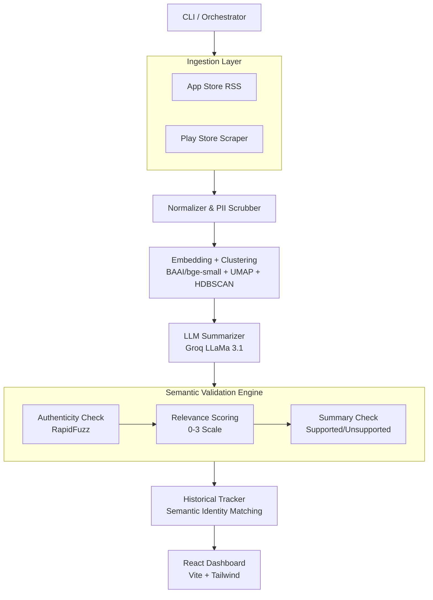

# Architecture — Weekly Product Review Pulse

**Companion to:** `ProblemStatement.md`
**Current scope:** Multi-product (INDMoney, Groww, etc.)
**Status:** Completed Build
**Owner:** Harsh (Product)

---

## 1. System overview

The system is an automated agent that, once per week per product:

1. **Ingests** public reviews from multiple platforms (App Store, Play Store).
2. **Normalizes** them into one canonical schema and **Scrubs** PII.
3. **Embeds + clusters** the text (UMAP + HDBSCAN) to find themes.
4. **LLM summarization** extracts top themes, verbatim quotes, and action ideas.
5. **Semantic Validation** enforces zero-hallucination guarantees using RapidFuzz and LLM relevance gating.
6. **Historical Tracking** matches new themes against past runs to calculate trends, aging, and velocity.
7. **Renders** an interactive React Dashboard with an Executive Briefing, sortable Theme Cards, and visual Trends.

---

## 2. Component responsibilities

| Component | Responsibility |
|---|---|
| **Orchestrator** | Sequences the pipeline, enforces token ceilings, writes run outputs. |
| **Ingestion Adapters** | Fetch raw reviews from App Store and Google Play. |
| **PII Scrubber** | Removes emails, phones, names before LLM processing. |
| **Embedding & Clustering** | Embeds text and forms density-based clusters (HDBSCAN) representing organic issues. |
| **LLM Summarizer** | Names themes, extracts quotes, and proposes action plans. |
| **Quote Validator** | The hallucination defense mechanism. Enforces authenticity, relevance, and summary logic. |
| **Historical Tracker** | Matches new themes to historical ledgers using embeddings to calculate week-over-week trends. |
| **React Dashboard** | The final user interface providing sortable themes, priority metrics, and evidence visibility. |

---

## 3. Data pipeline (Reasoning Core)

### 3.1 PII scrubbing (pre-LLM)
Emails, phone numbers, and handles are stripped before text enters the LLM or UI.

### 3.2 Embedding + clustering
- **Embed:** `BAAI/bge-small-en-v1.5` via sentence-transformers.
- **Reduce & Cluster:** UMAP for dimensionality reduction, HDBSCAN for density-based clustering.
- **Rank:** Clusters are ranked by volume and severity (low ratings weighted higher).

### 3.3 LLM summarization
For the top clusters, the LLM produces a theme name, summary description, root cause hypothesis, action plan, and verbatim candidate quotes.

### 3.4 Semantic Quote Validation (The Defense Pipeline)
This is the system's core trust guarantee to prevent hallucinations:
1. **Authenticity:** Every generated quote is matched against the original review text using `RapidFuzz` (≥90 ratio).
2. **Relevance:** An LLM validator scores each authentic quote from `0 to 3`. Quotes scoring `<2` are dropped as irrelevant.
3. **Summary Validation:** The LLM reads the final verified quotes and grades the theme summary as `Supported`, `Partially Supported`, or `Unsupported`.
4. **Culling:** If a theme retains `0` quotes or is marked `Unsupported`, it is completely dropped from the report.

### 3.5 Historical Trend Tracking
The `HistoryTracker` loads past pulse reports for the product.
- It embeds the new theme names.
- Uses cosine similarity (≥0.85 threshold) to map new themes to historical theme IDs.
- Calculates **WoW Mentions**, **WoW Priority**, **Age**, and **First Seen**.

---

## 4. Frontend Architecture

The delivery mechanism was upgraded from static Google Docs to an interactive React + Vite frontend (`frontend/src/`).
- **Framework:** React + Vite + Tailwind CSS.
- **Views:**
  - `Report.jsx`: High-level metrics, Rating Distribution charts, and filter controls.
  - `Themes.jsx`: Sortable list of Theme Cards, Quote Carousels, Priority Scores, Evidence Scores, and Trend Drivers.
- **Data Flow:** The backend Python pipeline writes a `[product]_report.json` file. The frontend dynamically loads this JSON payload to render the dashboard.

---

## 5. Security & Quality Controls
- **Hallucination Prevention:** Hard failure for themes with 0 supporting quotes.
- **Determinism:** Seeded UMAP clustering ensures stable clusters across re-runs.
- **Prompt Injection:** Reviews are strictly treated as data blocks within prompts.
