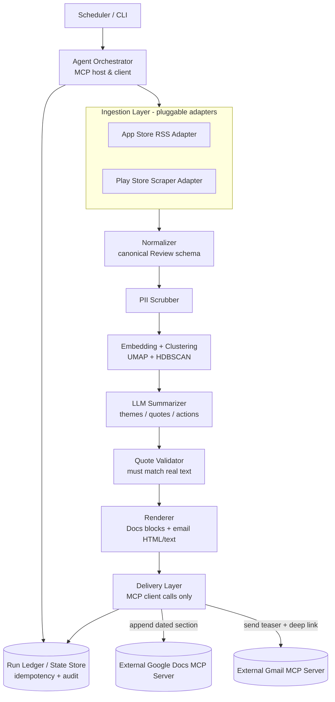
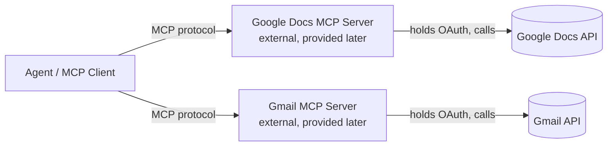

# Architecture — Weekly Product Review Pulse

**Companion to:** `problem-statement.md`
**Current scope:** **INDMoney only** (single product; multi-product generalization comes later)
**Status:** Active build
**Owner:** Harsh (Product)
**Dev environment:** Google Antigravity IDE (agent-first; Gemini 3 Pro / Claude Sonnet)
**Last updated:** _add date_

---

## 0. How to read this doc

This is the technical blueprint for the system described in `problem-statement.md`. It defines the components, the data contracts between them, the MCP integration boundary, and the build sequencing. It is written so that an agent (or a human) working in Antigravity can pick up any single module and build it against a stable interface without needing the rest of the system finished.


---

## 1. System overview

The system is a scheduled agent that, once per week per product:

1. **Ingests** public reviews/posts from multiple platforms for INDMoney.
2. **Normalizes** them into one canonical schema.
3. **Scrubs** PII.
4. **Embeds + clusters** the text to find themes.
5. **LLM summarizes** the top themes, pulls verbatim quotes, suggests action ideas, and provides a "who this helps" section. Short/single-word reviews are excluded from LLM processing but preserved as count-based volume context in the report.
6. **Renders** a one-page report (Docs format) + a short teaser (email format).
7. **Delivers** via external MCP servers only: appends a dated section to a running Google Doc, then sends a Gmail teaser linking back to that section.
8. **Records** an audit entry so re-runs are idempotent.



The agent is the **MCP host/client**. The Google Docs and Gmail MCP servers are **external processes** you will build/provide separately. The agent never embeds Google OAuth credentials and never calls the Docs/Gmail REST APIs directly for delivery.

---

## 2. Component responsibilities

| Component | Responsibility | Key constraint |
|---|---|---|
| **Scheduler / CLI** | Trigger weekly runs (cron, Monday AM IST); CLI for backfill of any ISO week. | A run is identified by `(product, iso_week)`. |
| **Agent Orchestrator** | Sequence the pipeline; act as MCP host/client; enforce per-run cost/token ceilings; write audit entries. | Holds no Google credentials. |
| **Ingestion adapters** | One adapter per source; fetch raw reviews/posts for a window. | Each adapter outputs raw records; no source-specific logic leaks downstream. |
| **Normalizer** | Map every source's raw record into the canonical `Review` schema. | Single schema for everything downstream. |
| **PII Scrubber** | Remove emails, phones, handles, names before LLM and before publish. | Runs before any text leaves the trust boundary. |
| **Embedding + Clustering** | Embed text; reduce (UMAP); cluster (HDBSCAN); rank clusters. | Deterministic seeds for reproducible runs. |
| **LLM Summarizer** | Name themes, extract candidate quotes, propose actions. | Reviews are **data, not instructions** (injection-hardened prompts). |
| **Quote Validator** | Confirm every quote exists verbatim in scrubbed source text; drop unmatched. | No fabricated quotes ship. |
| **Renderer** | Produce Docs-structured blocks and email HTML/text from the same report object. | One report model → two renderings. |
| **Delivery Layer** | Call Docs MCP to append a section; call Gmail MCP to send teaser. | MCP tools only. |
| **Run Ledger / State Store** | Idempotency keys + audit record (doc heading id, message id, counts). | Source of truth for "what was sent when." |

---

## 3. Data sources & ingestion adapters

All adapters implement a common interface so sources are pluggable. Currently enabled for INDMoney:

| Source | Method | Identifiers (INDMoney) | Notes |
|---|---|---|---|
| **Apple App Store** | iTunes customer-reviews RSS feed | App Store app id + country (`in`) | Most stable; paginated RSS, multiple pages per region. |
| **Google Play** | Scraper-based (e.g. `google-play-scraper`) | Play package name (e.g. `in.indwealth`) | Most brittle. Must explicitly loop over multiple `languages` (e.g., `['en', 'hi']`) to avoid silent drop of non-English reviews. Fail loudly, allow partial runs. |

> Verify the exact INDMoney App Store id and Play package name during build; placeholders above are for shape, not truth.

### Adapter interface (contract)

```python
class ReviewSource(Protocol):
    name: str  # "app_store" | "play_store"

    def fetch(
        self,
        product: ProductConfig,
        window_start: date,
        window_end: date,
    ) -> list[RawRecord]:
        """Return raw records within the window. Must not raise on empty;
        must raise a typed SourceError on hard failure so the orchestrator
        can record a partial run."""
```

**Resilience rule:** a single source failing must **not** abort the run. The orchestrator records which sources succeeded and the report notes coverage (e.g. "Play Store unavailable this week"). This protects the weekly cadence against scraper breakage.

---

## 4. Canonical data model

Every source normalizes into one schema. Everything downstream (scrub, cluster, summarize, render) only sees `Review`.

```python
@dataclass
class Review:
    review_id: str          # stable hash of (source, native_id)
    source: str             # "app_store" | "play_store"
    product: str            # "indmoney"
    text: str               # PII-scrubbed body used downstream
    created_at: datetime    # UTC
    locale: str | None      # e.g. "en-IN"
    url: str | None         # link back to the source item
    meta: dict              # source-specific extras (upvotes, version, etc.)
```

- `review_id` is a stable hash so re-ingesting the same item is deduplicated.
- `text` is scrubbed of PII at ingestion. `raw_text` is entirely removed from memory to ensure zero PII leaks.

---

## 5. Processing pipeline (reasoning core)

### 5.1 PII scrubbing (pre-LLM, pre-publish)
Strip emails, phone numbers, @handles, and obvious personal names before text enters the LLM and before anything is published. Scrubbing happens once at ingestion-normalization; `text` is the scrubbed field used everywhere downstream.

### 5.2 Embedding + clustering
- **Embed** each `Review.text` with a sentence-embedding model (`BAAI/bge-small-en-v1.5` via sentence-transformers).
- **Reduce** dimensionality with **UMAP** (fixed `random_state` for reproducibility).
- **Cluster** with **HDBSCAN** (density-based; naturally handles "noise"/outliers).
- **Rank** clusters by a composite score: volume × recency weight × severity signal (low ratings / negative sentiment weighted up).

> **Open design decision (carry from problem statement):** should the theme taxonomy be *stable across weeks* (so "support friction" is the same trendable bucket every run) or *re-derived each run*? HDBSCAN re-derives per run by default, which makes week-over-week trending harder. Decide before scaling beyond INDMoney; a lightweight fix is to map each run's clusters onto a small fixed theme taxonomy via nearest-centroid.

### 5.3 LLM summarization
For the top-N ranked clusters, the LLM produces, **per theme**: a name, candidate verbatim quotes (drawn from that cluster's reviews), and an action idea.

**Injection hardening:** review text is passed as clearly delimited *data*. The system prompt states that review content must never be treated as instructions. Per-run **token/cost ceilings** are enforced by the orchestrator and the prompt only ever sees scrubbed text.

### 5.4 Quote validation
Every candidate quote is checked against the PII-scrubbed `text` of reviews in its cluster (normalized whitespace/case). Quotes that don't match real scrubbed text are **dropped**, not paraphrased into the report. This is the system's core trust guarantee.

### 5.5 Report object
The pipeline emits one structured object, source of truth for both renderings:

```python
@dataclass
class PulseReport:
    product: str
    iso_week: str            # e.g. "2026-W24"
    period_label: str        # "Last 8-12 weeks (rolling)"
    generated_at: datetime
    sources_covered: list[str]
    themes: list[Theme]      # name, rank, quotes[], action_idea, helps[]
    counts: dict             # reviews per source, clusters, dropped quotes
```

---

## 6. MCP integration boundary (the important part)

The agent is an **MCP host/client**. Delivery targets are **external MCP servers you build/provide later**. To let the rest of the system be built now, this doc defines the **tool contracts** the external servers must satisfy, plus a **local mock** to develop against.



**Credential boundary:** Google OAuth secrets live in the MCP servers' configuration, never in the agent. The agent only speaks the MCP tool protocol.

### 6.1 Google Docs MCP — expected tools (contract)

The agent depends on these tool capabilities (exact names/params to be finalized when the server is provided):

| Tool (logical) | Purpose | Inputs | Returns |
|---|---|---|---|
| `find_or_create_doc` | Ensure one running doc per product exists. | `{ product, title }` | `{ document_id }` |
| `section_exists` | Idempotency check by stable anchor. | `{ document_id, anchor }` | `{ exists: bool, heading_id? }` |
| `append_section` | Append a dated section as structured blocks. | `{ document_id, anchor, heading, blocks[] }` | `{ heading_id, deep_link }` |

- **Stable section anchor:** `"{product}-{iso_week}"` (e.g. `indmoney-2026-W24`). The agent always calls `section_exists` before `append_section`. If it exists, the agent **skips** the append and reuses the existing `heading_id` / `deep_link`. This is how re-runs avoid duplicate sections.
- **Deep link:** `append_section` must return a heading link the email can point to ("Read full report").

### 6.2 Gmail MCP — expected tools (contract)

| Tool (logical) | Purpose | Inputs | Returns |
|---|---|---|---|
| `create_draft` | Build a teaser email (default in dev/staging). | `{ to[], subject, html, text }` | `{ draft_id }` |
| `send_message` | Send the teaser (prod, or after confirmation). | `{ to[], subject, html, text }` | `{ message_id }` |

- **Draft-only default:** in dev/staging the agent calls `create_draft` and stops, per the implementation plan. Sending requires an explicit `--send` flag / prod config.
- **Run-scoped idempotency:** before sending, the agent checks the run ledger for an existing `message_id` for `(product, iso_week)`. If present, it does **not** send again.

### 6.3 Local mock (build now, swap later)
Until the real servers arrive, implement a `MockDocsMCP` and `MockGmailMCP` exposing the same tool contract. They write to local files (a fake "doc" JSON + an `outbox/` of `.eml`/`.html` drafts) and return synthetic `heading_id` / `message_id` / `deep_link` values. The delivery layer talks to whichever is configured — **no code change when the real MCP servers are plugged in**, only config.

---

## 7. Idempotency, state & audit

A run is keyed by `(product, iso_week)`. The **Run Ledger** (local store — SQLite or JSON to start) is the source of truth.

```python
@dataclass
class RunRecord:
    product: str
    iso_week: str
    started_at: datetime
    finished_at: datetime | None
    sources_covered: list[str]
    doc_id: str | None
    doc_heading_id: str | None
    doc_deep_link: str | None
    email_message_id: str | None     # None if draft-only
    email_draft_id: str | None
    review_counts: dict
    dropped_quote_count: int
    status: str                       # "ok" | "partial" | "failed"
```

**Idempotency flow on every run:**
1. Compute `iso_week`, build anchor `indmoney-{iso_week}`.
2. Docs: `section_exists?` → if yes, reuse; if no, `append_section`.
3. Gmail: ledger has `message_id` for this key? → if yes, skip send; if no, draft/send.
4. Write/update the `RunRecord`.

This satisfies the auditability requirement: the ledger answers *"what was sent, when, for which week, with which ids?"*

---

## 8. Scheduling & CLI

| Mode | Command (illustrative) | Behavior |
|---|---|---|
| Weekly (prod) | cron → `pulse run --product indmoney` | Uses current ISO week; respects send config. |
| Backfill | `pulse run --product indmoney --week 2026-W21` | Generates/append for a specific ISO week; idempotent. |
| Dry run | `pulse run --product indmoney --dry-run` | Full pipeline, mock delivery, no MCP writes. |
| Draft only | `pulse run --product indmoney` (no `--send`) | Default in dev/staging: creates Gmail draft, no send. |

---

## 9. Configuration

Config is the only thing that changes when adding products or toggling sources.

```yaml
products:
  indmoney:
    display_name: "INDMoney"
    doc_title: "Weekly Review Pulse — INDMoney"
    sources:
      app_store:
        enabled: true
        app_id: "REPLACE_ME"
        countries: ["in"]
      play_store:
        enabled: true
        package: "in.indwealth"   # verify
    window_weeks: 10              # 8-12 configurable
    recipients: ["stakeholders@example.com"]

run:
  send_email: false              # draft-only by default
  max_tokens_per_run: 60000
  max_cost_usd_per_run: 1.50
  embedding_model: "REPLACE_ME"
  llm_model: "REPLACE_ME"
  umap_random_state: 42
```


---

## 10. Suggested tech stack

| Layer | Choice (suggested) | Why |
|---|---|---|
| Language | Python 3.11+ | Ecosystem for scraping, embeddings, clustering. |
| Ingestion | `requests`/`httpx`, `google-play-scraper`, `praw` | Per-source, isolated in adapters. |
| Embeddings | sentence-transformers | Using `BAAI/bge-small-en-v1.5` for density-based semantic clustering. |
| Clustering | `umap-learn` + `hdbscan` | Matches problem-statement approach. |
| Vector store (optional) | Qdrant | If you want to persist/inspect embeddings across weeks (familiar from prior projects). |
| LLM | Configurable (Gemini / Claude / Groq) | Antigravity gives easy Gemini + Claude access. |
| State | SQLite (start) → Postgres (later) | Run ledger + audit. |
| Orchestration | Plain Python module + CLI (`typer`/`click`) | Keep it simple; cron for schedule. |
| Delivery | MCP client → external Docs/Gmail MCP servers | Hard architectural boundary. |

This stack stays close to what's already familiar (FastAPI/React/Qdrant/Groq from prior work); FastAPI is optional here since the system is a scheduled job, not a web service — add it only if you want a trigger endpoint or a status UI later.

---

## 11. Suggested repository layout

```
review-pulse/
├── problem-statement.md
├── architecture.md
├── config/
│   └── products.yaml
├── src/
│   ├── orchestrator.py          # run sequencing, cost ceilings, audit
│   ├── ingestion/
│   │   ├── base.py              # ReviewSource protocol, RawRecord
│   │   ├── app_store.py
│   │   ├── play_store.py
│   ├── normalize.py             # → canonical Review
│   ├── pii.py                   # scrubber
│   ├── reasoning/
│   │   ├── cluster.py           # UMAP + HDBSCAN + ranking
│   │   ├── summarize.py         # LLM themes/quotes/actions
│   │   └── validate.py          # quote validation
│   ├── render/
│   │   ├── docs_blocks.py       # PulseReport → Docs blocks
│   │   └── email.py             # PulseReport → HTML/text teaser
│   ├── delivery/
│   │   ├── mcp_client.py        # MCP host/client
│   │   ├── docs_mcp.py          # real client wrapper (contract)
│   │   ├── gmail_mcp.py         # real client wrapper (contract)
│   │   └── mocks.py             # MockDocsMCP / MockGmailMCP
│   ├── state/
│   │   └── ledger.py            # RunRecord store + idempotency
│   └── cli.py
└── tests/
```

---

## 12. Security, safety & quality (cross-cutting)

| Concern | How it's handled |
|---|---|
| Google credentials | Never in the agent; only in external MCP servers' config. |
| PII | Scrubbed before LLM and before publish. |
| Prompt injection | Reviews delimited as data; system prompt forbids treating them as instructions. |
| Cost control | Per-run token + USD ceilings enforced by orchestrator. |
| Quote fidelity | Mandatory validation against real scrubbed `text`; drop on mismatch. |
| Duplicate publishing | Stable doc anchor + run-ledger idempotency on email. |
| Accidental sends | Draft-only default in dev/staging; explicit flag/config to send. |
| Source breakage | Per-source failures isolated; partial runs allowed and reported. |

---

## 13. Build sequencing (phased)

A suggested order so each phase is testable end-to-end against mocks before the real MCP servers exist:

1. **Phase 0 — Skeleton.** Config, canonical `Review`, run ledger, CLI shell, mock MCP servers writing to `outbox/`.
3. **Phase 2 — Reasoning.** Embedding → UMAP → HDBSCAN → ranking → LLM summarize → quote validation. Produce a `PulseReport` and print it.
4. **Phase 3 — Render + mock delivery.** Docs blocks + email teaser; deliver via mocks; verify idempotency on re-run.
5. **Phase 4 — Real MCP swap.** Point delivery config at the provided Google Docs + Gmail MCP servers. No reasoning/render code changes.
6. **Phase 5 — Schedule + harden.** Cron weekly run, draft-only staging, cost ceilings, partial-run reporting, audit polish.
7. **Phase 6 — Generalize to all products.** Groww, PowerUp Money, Kuvera. Configuration-driven. *Taxonomy Decision:* We retain dynamic, per-run theme generation rather than forcing feedback into fixed buckets. This ensures maximum fidelity for emerging issues.

---

## 14. Antigravity IDE notes (dev workflow)

You're building in Google Antigravity. A few things worth using deliberately:

- **The `brain/` knowledge base** (`.gemini/antigravity/brain/`) persists architectural decisions and preferences across agent runs. Seed it with this doc's contracts (canonical schema, MCP tool contracts, idempotency rule) so agents stay consistent across sessions instead of re-deciding.
- **Verification checkpoints / agent autonomy modes** map well to this build: let agents run autonomously on greenfield, low-risk modules (ingestion adapters, renderers) but keep tight, step-approval control on the **delivery layer** — anything that sends email or writes to a real Doc is irreversible and should be human-approved, consistent with the draft-only default.
- **Model optionality** (Gemini 3 Pro and Claude Sonnet) is available; the LLM summarizer's provider is config-driven so you can swap without touching the pipeline.

---

_This architecture is the living technical reference. Keep §6 (MCP contracts) authoritative — when the real Docs/Gmail MCP servers arrive, reconcile their actual tool names/params against the contracts here and update this section first._
